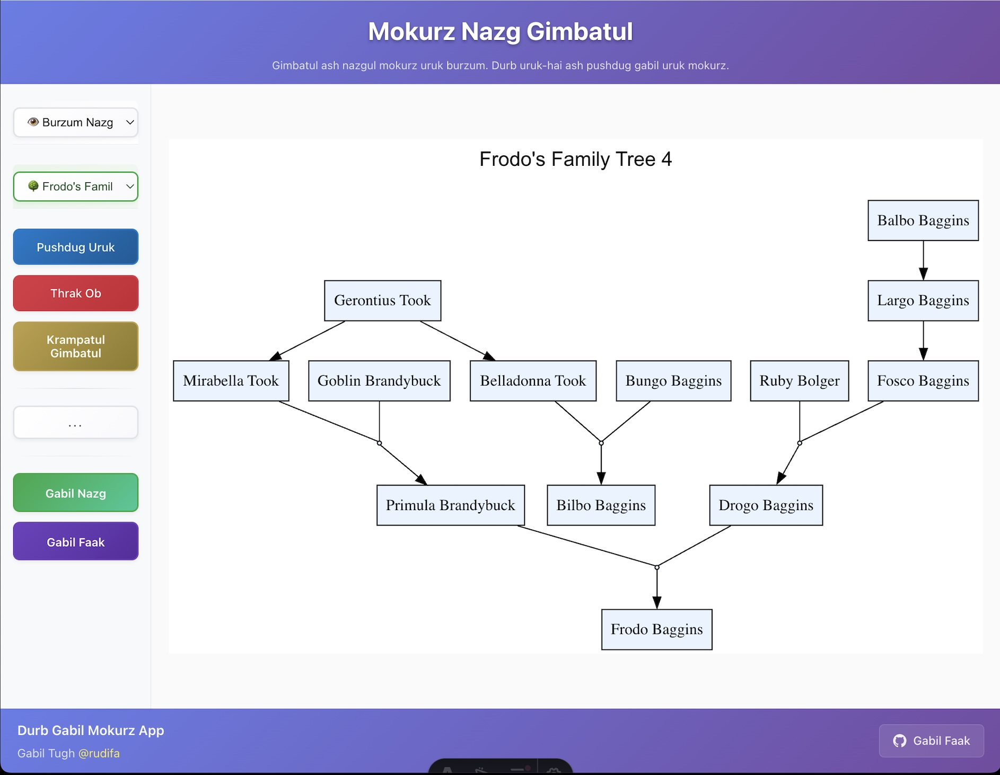
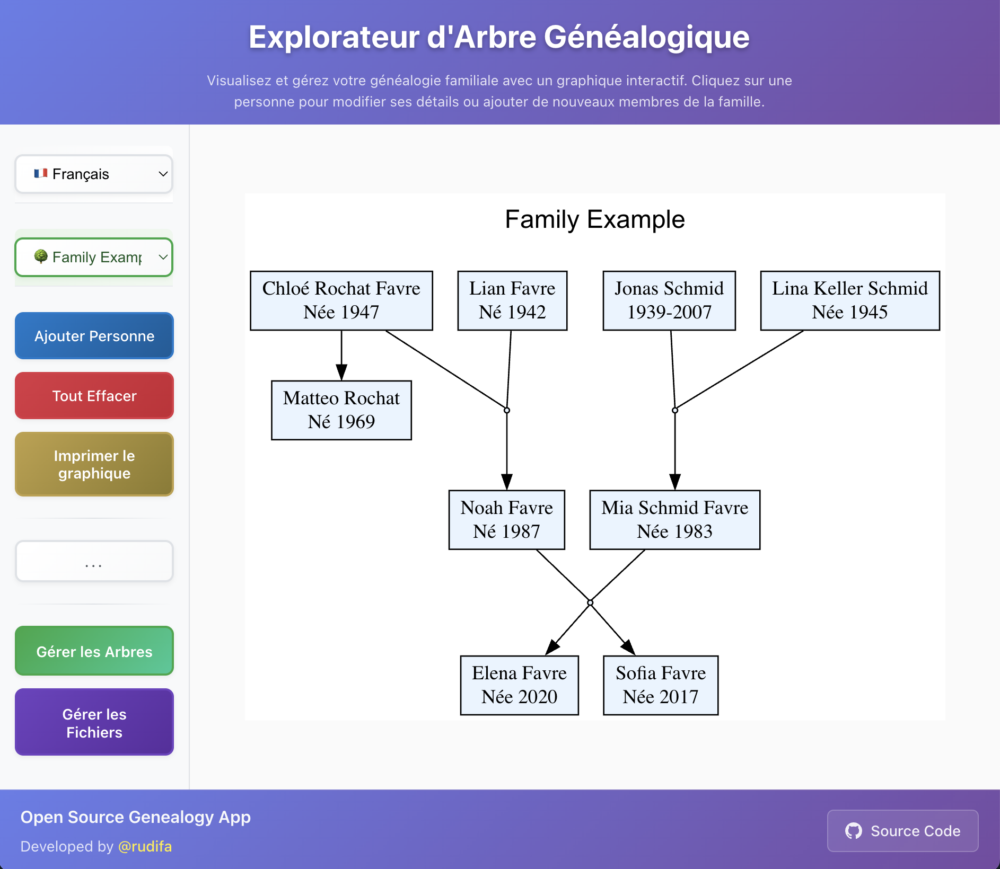

# genealogy-astro

#### A simple genealogy graph viewer + editor built with Astro

## Features

- **Interactive Family Tree:** View and edit your family tree visually, in your browser.
- **Persons**: The family tree consists of persons, each with their _Name_ and optionally their _Mother_, _Father_ and _Info_.
- **Multi-Tree Management:** Create and manage multiple family trees, all within your browser.
- **Easy Editing:** Add, edit, and remove people with a simple dialog. Add and remove family trees.
- **Multilingual:** Full user experience in English, French, German, Japanese and Burzum Nazg.
- **Persistent Storage:** Your work is automatically saved in your browser's local storage.
- **Responsive Design:** Works on desktop, laptop, tablet, and mobile.
- **Live Demo:** Published on Vercel at [genealogy-astro.vercel.app](https://genealogy-astro.vercel.app/)
- **File Download/Upload:** Save your trees to your computer or tablet for backup or sharing, and load them back anytime.
- **Print Tree:** Print the displayed family tree graph to your network printer or save it as a PDF.

## Missing features

- **Undo/Redo:** No undo/redo functionality yet.
- **Photo/Image Support:** Currently, you cannot add photos or images to persons.
- **Tree Sharing:** No built-in sharing functionality to share trees with others (you have to download files and share them manually).

## Possible features

- add more languages
- add person's siblings
- add undo/redo functionality
- use email for sharing trees
- add photo/image to a person

## Screenshots





## Implementation Details


- The revised implementation uses a state singleton object of type `App` for managing application state, enabling communication between Astro components, and holding the data and language models.

```
app =  {
    data,           // the user data model
    translations,   // the translations data model
    uiState,        // the UI state model (flags and functions)
  }
```

- `App` is the wrapper that combines all these models and provides a shared state container for the application.
  - `AppData` provides the user data model (family trees), with subscribe/notify for updates.
  - `AppLanguage` provides the translations for UI elements in the available languages and the selected language, with subscribe/notify for language changes.
  - `UIState` provides the UI state model (flags) and sharing functions for inter-component actions.

This structure is based on the Observer pattern (for the subscribe/notify mechanism) combined with a centralized state management approach. In frontend development, this is often referred to as a "state container" or "store" pattern. 

The revised implementation removes the ad-hoc global `window.xyz` variables and custom events that were used in the early releases of the project for state management and communication between components.

Instead, it uses a more structured approach with a single `App` object that encapsulates all necessary data and methods, and offers a solid foundation for future enhancements and features.

The project features `vitest` for unit testing of the data model components and `cypress` for the end-to-end tests of UI sequences, ensuring that the core functionality is tested and reliable.
